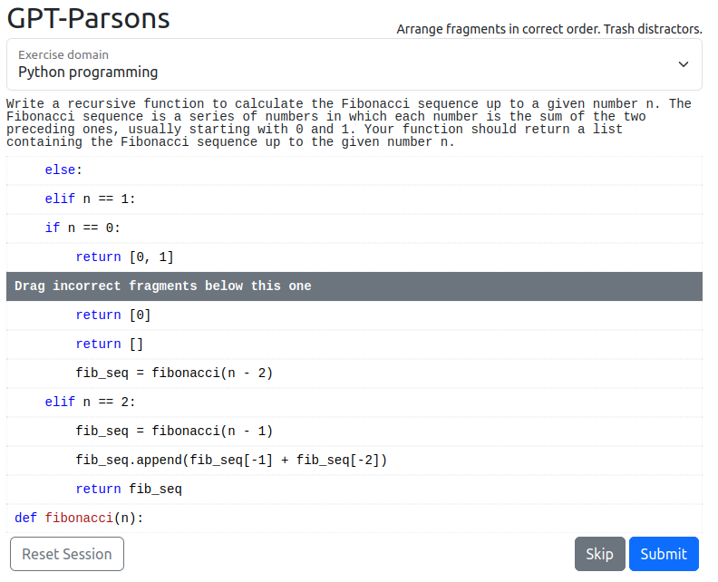
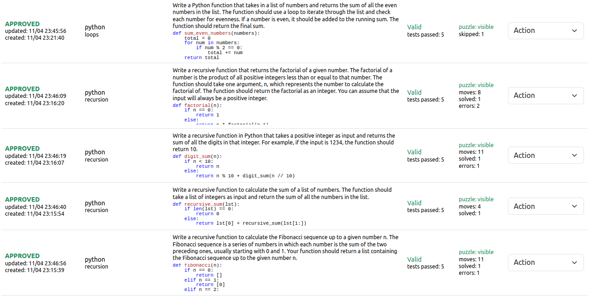

# GPT-Parsons 

The system creates 1D [Parsons puzzles](https://en.wikipedia.org/wiki/Parsons_problem) with help of ChatGPT.
The language model is used as database of programming exercises and distractors (incorrect fragments). 
User is asked to rearrange the fragments to form the correct order and to trash the distractors. 

Example:

## Domains 

Public web interface [Python programming puzzles](https://gptparsons.z13.web.core.windows.net).
1. DONE: Python puzzles. Reorder fragments to create solution for given exercise. Trash wrong code lines. 
2. TBD: Historical puzzles. Reorder fragments to form correct time sequence according to puzzle topic. Trash wrong facts.
3. TBD: Chain of reasoning. Distinct premises and conclusions. Trash statements that does not follow 

## Validation 

LLM output have to be validated. Instructor UI is hosted at /config route and requires API key to perform manipulations that involves AI service. The generated content is validated manualy and with help of tools:
1. DONE: Compilation of generated code, running unit tests that were also generated
2. TBD: Validate generated links to Wikipedia and compare contents to confirm generated fact
3. TBD: Validate symbolic representation of premises and conclusions with help of z3 solver. 

Validated and approved exercises example:

## Research goals 

1. Compute statistics of LLM model performance on task of generating the exercises (generaton of errors, complexity of the code, duplication). Currently removing of duplicates is implemented with "avoid" part of prompt.
2. Register move event of fragments rearrangement in DB for analysis of behavior. 

## Implementation details

1. Frontend: static website (hosted in Azure blob)
2. Backend: Azure functions (python)
3. CosmosDB NoSQL
4. AI: Azure ML Prompt Flow, deployed as App Service. 

Generation of one exercise with OpenAI API requires from 10 to 40 seconds. Therefore, it happens asynchronously and is initiated by instructor. Another reason for this decision is the cost of calling ChatGPT endpoint. 

